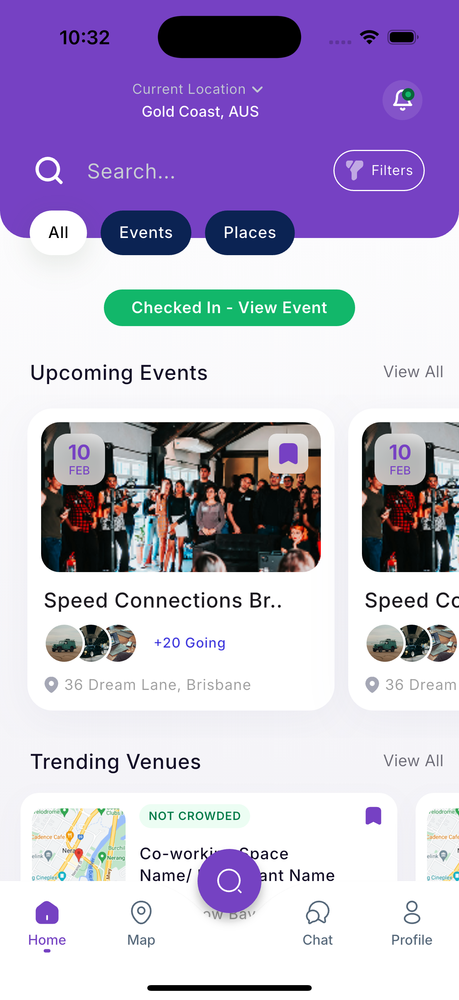
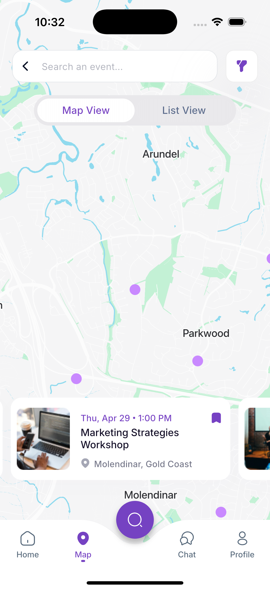
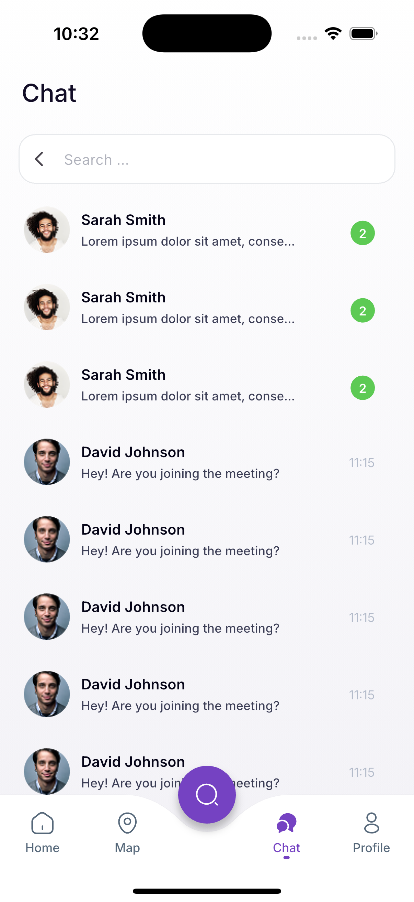
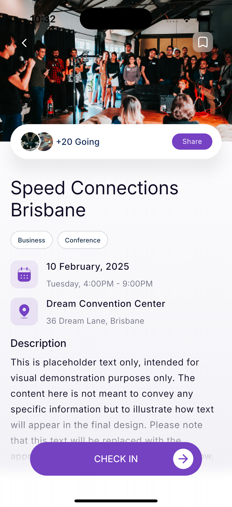

# 🏨 Hotel Booking App UI

A modern **Hotel Booking App UI** built with **Flutter** and **GetX** for state management.  
This app focuses purely on **UI/UX design** and does not include backend integration — perfect for learning and customizing for your own booking platform.

---

## ✨ Features

- Beautiful and responsive hotel booking interface  
- State management with **GetX**  
- Smooth navigation and transitions  
- Well-structured and maintainable codebase  
- Customizable hotel cards, search, and booking screens  

---

## 📱 Screenshots

<p align="center">
  
  
  
  
</p>

---

## 🚀 Getting Started

### 1️⃣ Prerequisites
Make sure you have:
- [Flutter SDK](https://flutter.dev/docs/get-started/install)
- Dart
- Android Studio or VS Code
- A device/emulator to run the app

### 2️⃣ Clone the Repository
```bash
git clone https://github.com/aruninf/hotel-booking-app-ui.git
cd hotel-booking-app-ui
